# PPS-Unidad2Actividad1-Cristian

## Índice

- [PPS-Unidad2Actividad1-Cristian](#pps-unidad2actividad1-cristian)
  - [Índice](#índice)
  - [Trazado de la vulnerabilidad](#trazado-de-la-vulnerabilidad)
  - [Información sobre vulnerabilidades](#información-sobre-vulnerabilidades)
  - [Información sobre la debilidad explotada para esta vulnerabilidad](#información-sobre-la-debilidad-explotada-para-esta-vulnerabilidad)
  - [Patrones de ataque](#patrones-de-ataque)
  - [JSON de información del CVE](#json-de-información-del-cve)


## Trazado de la vulnerabilidad

Para desarrollar el primer paso de la actividad, se propone seguir el rastro de una vulnerabilidad específica en GoAnywhere MFT de Fortra, comenzando con la información proporcionada por el INCIBE y profundizando con los detalles ofrecidos por Fortra. A continuación, se detallan los pasos a seguir:

1. **Identificación de Productos Afectados**

El aviso del INCIBE, publicado el 24 de enero de 2024, informa sobre una vulnerabilidad crítica en los siguientes productos de Fortra:

- **GoAnywhere MFT**, desde la versión 6.0.1 hasta la versión 7.4.1.

2. **Descripción de la Vulnerabilidad**

El INCIBE menciona que esta vulnerabilidad, identificada como **CVE-2024-0204**, permite a un usuario no autorizado crear un usuario administrador a través del portal de administración, comprometiendo la confidencialidad, integridad y disponibilidad de los datos del usuario.

3. **Recomendaciones del INCIBE**

Para mitigar el riesgo, el INCIBE recomienda a los usuarios **actualizar los productos afectados a la versión 7.4.1 o superior**. Esta vulnerabilidad también puede ser eliminada en despliegues sin contenedor, eliminando el archivo `InitialAccountSetup.xhtml` en el directorio de instalación y reiniciando los servicios. Para instancias implementadas en contenedores, será necesario reemplazar el archivo mencionado por uno vacío y reiniciar.

4. **Referencias**

- [FI-2024-001 - Authentication Bypass in GoAnywhere MFT](https://www.fortra.com/security/advisory/fi-2024-001)

<p align="center">
  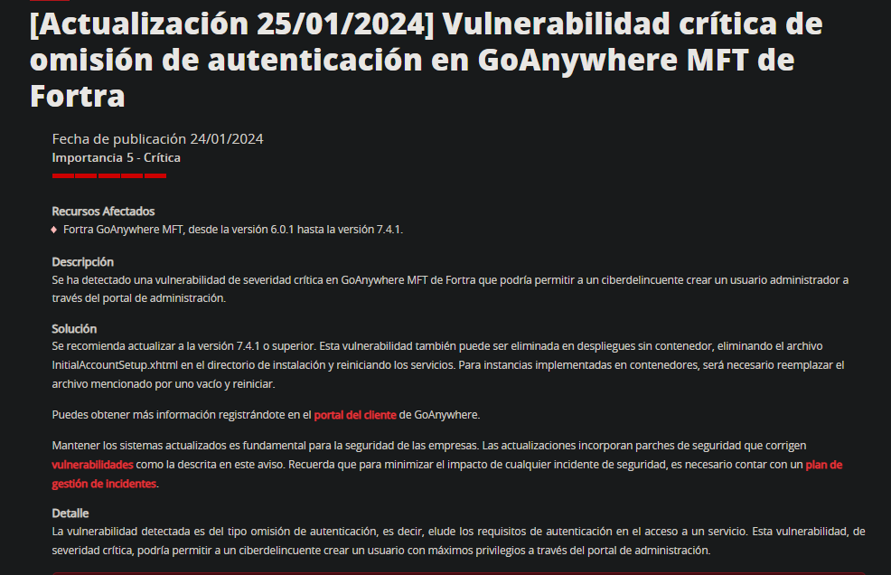
</p>
<p align="center"><em>Imagen 1: Información ofrecida por el INCIBE</em></p>

## Información sobre vulnerabilidades

1. **Identificación de Productos Afectados**

El aviso de Fortra, publicado el 22 de enero de 2024, informa sobre una vulnerabilidad crítica en los siguientes productos:

- **GoAnywhere MFT** versiones 6.x desde la 6.0.1
- **GoAnywhere MFT** versiones 7.x anteriores a la 7.4.1

2. **Descripción de la Vulnerabilidad**

Esta vulnerabilidad, identificada como **CVE-2024-0204**, permite a un usuario no autorizado crear un usuario administrador a través del portal de administración, comprometiendo la confidencialidad, integridad y disponibilidad de los datos del usuario. La vulnerabilidad está clasificada bajo **CWE-425: Solicitud Directa ('Navegación Forzada')** y tiene una puntuación CVSSv3.1 de 9.8, indicando una severidad crítica.

3. **Recomendaciones de Fortra**

Para mitigar el riesgo, Fortra recomienda a los usuarios:

- **Actualizar** los productos afectados a la versión 7.4.1 o superior.

Además, para despliegues sin contenedor, se puede eliminar la vulnerabilidad eliminando el archivo `InitialAccountSetup.xhtml` en el directorio de instalación y reiniciando los servicios. Para instancias implementadas en contenedores, será necesario reemplazar el archivo mencionado por uno vacío y reiniciar.

4. **Referencias**

- [FI-2024-001 - Authentication Bypass in GoAnywhere MFT](https://www.fortra.com/security/advisories/product-security/fi-2024-001)


<p align="center">
  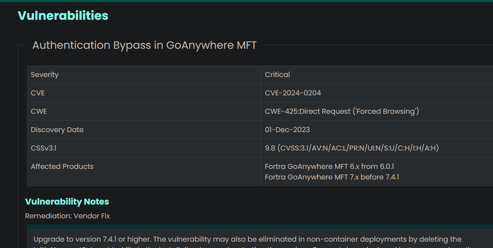
</p>
<p align="center"><em>Imagen 2: Información sobre vulnerabilidades</em></p>

Búscando en la página de [cve.org](https://www.cve.org/) realizamos una búsqueda de la vulnerabilidad en el buscador y obtenemos esta información, que nos ayuda a corroborar los datos:
<p align="center">
  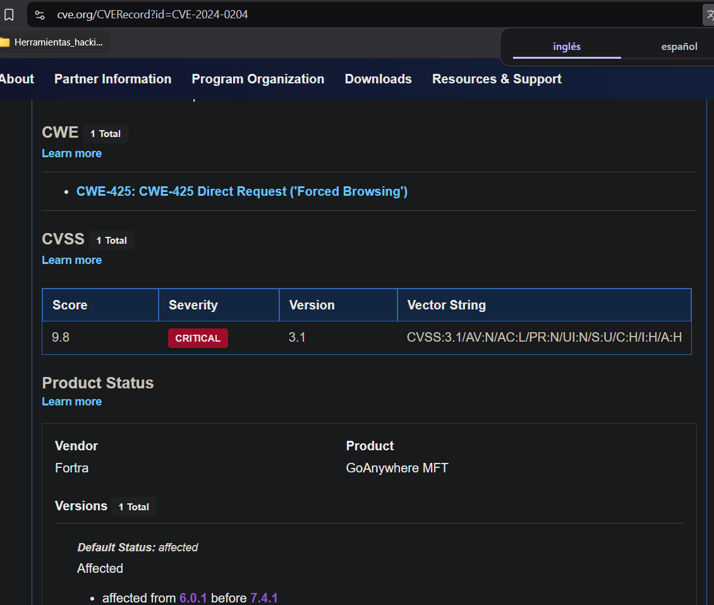
</p>
<p align="center"><em>Imagen 3: Búsqueda en cve.org</em></p>

Búscando en la página de [NIST: NVD](https://nvd.nist.gov/search) nos dirigimos al apartado de búsqueda para obtener la siguiente información sobre la vulnerabilidad:

1. **Estado: MODIFICADO**
Esta vulnerabilidad ha sido modificada desde que fue analizada por última vez por la NVD. Está en espera de un nuevo análisis, lo que puede resultar en más cambios en la información proporcionada.

2. **Descripción**
Bypass de autenticación en **GoAnywhere MFT** de Fortra en versiones anteriores a la **7.4.1** permite a un usuario no autorizado crear un usuario administrador a través del portal de administración.

3. **Métricas de Severidad**

   - CVSS 3.x
     - **Puntuación Base:** 9.8 (CRÍTICO)
     - **Vector:** `CVSS:3.1/AV:N/AC:L/PR:N/UI:N/S:U/C:H/I:H/A:H`
     - **CNA:** Fortra

<p align="center">
  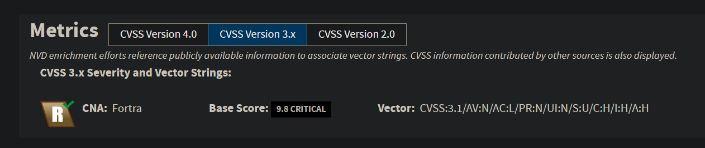
</p>
<p align="center"><em>Imagen 4: Críticidad de la vulnerabilidad</em></p>

<p align="center">
  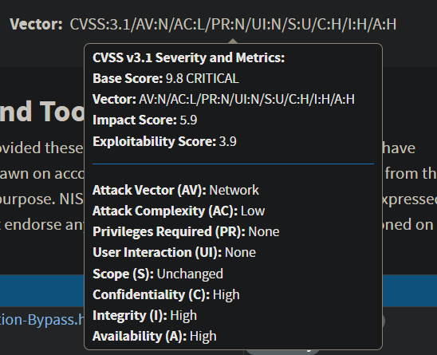
</p>
<p align="center"><em>Imagen 5: Valores correspondientes a las diferentes métricas</em></p>
   
   - Severidad y Métricas:

     - **Puntuación Base:** 9.8 (CRÍTICO)
     - **Vector:** `AV:N/AC:L/PR:N/UI:N/S:U/C:H/I:H/A:H`
     - **Impact Score:** 5.9
     - **Exploitability Score:** 3.9

  - Detalles del Vector de Ataque:
     - **Attack Vector (AV):** Network
     - **Attack Complexity (AC):** Low
     - **Privileges Required (PR):** None
     - **User Interaction (UI):** None
     - **Scope (S):** Unchanged
     - **Confidentiality (C):** High
     - **Integrity (I):** High
     - **Availability (A):** High 

4. **Debilidades Asociadas**
   - **CWE-ID:** CWE-425
   - **Nombre:** Solicitud Directa ('Navegación Forzada')
   - **Fuente:** NIST / Fortra

5. **Software Afectado**
   - **GoAnywhere MFT** versión 6.0.0 y superiores
   - **GoAnywhere MFT** versión 7.0.0 hasta 7.4.1 (excluyendo)

6. **Avisos y Recursos Externos**

   - [Packet Storm Security - Authentication Bypass](http://packetstormsecurity.com/files/176683/GoAnywhere-MFT-Authentication-Bypass.html)
   - [Packet Storm Security - Remote Code Execution](http://packetstormsecurity.com/files/176974/Fortra-GoAnywhere-MFT-Unauthenticated-Remote-Code-Execution.html)
   - [GoAnywhere Web Security Advisories](https://my.goanywhere.com/webclient/ViewSecurityAdvisories.xhtml) *(Requiere permisos)*
   - [Fortra - Aviso de seguridad](https://www.fortra.com/security/advisory/fi-2024-001)

7. **Historial de Cambios**
Se han registrado **6 cambios** en la información de esta vulnerabilidad.

> **Nota:** Se recomienda actualizar a la versión **7.4.1 o superior** para mitigar el riesgo.

<p align="center">
  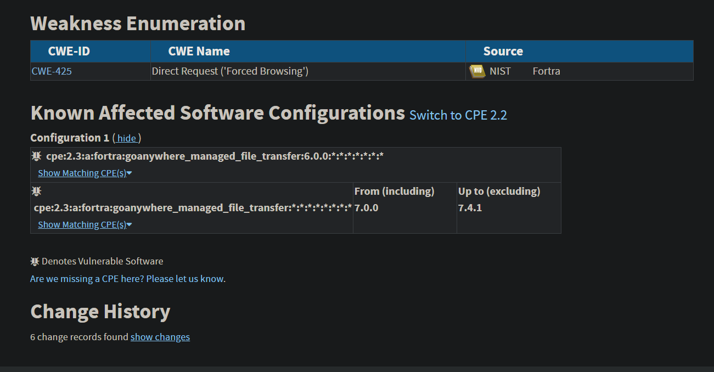
</p>
<p align="center"><em>Imagen 6: Búsqueda en NIST: NVD</em></p>

## Información sobre la debilidad explotada para esta vulnerabilidad

Las aplicaciones web vulnerables a ataques de solicitud directa suelen asumir erróneamente que ciertos recursos solo pueden ser accedidos a través de una ruta de navegación específica, aplicando autorizaciones únicamente en puntos concretos de dicha ruta. Esta suposición incorrecta permite que un atacante acceda directamente a recursos sensibles proporcionando la URL correspondiente, eludiendo así los controles de seguridad implementados. **No** es una vulnerabilidad específica **para un lenguaje**. Suele afectar a **páginas webs**.

1. **Consecuencias Comunes**

   - **Confidencialidad**: Lectura no autorizada de datos de la aplicación.
   - **Integridad**: Modificación no autorizada de datos de la aplicación.
   - **Disponibilidad**: Posible interrupción de servicios debido a accesos no controlados.
   - **Control de Acceso**: Ejecución de comandos o código sin autorización; escalamiento de privilegios o suplantación de identidad.

2. **Mitigaciones Potenciales**

   - **Fase de Arquitectura y Diseño**:
     - Aplicar controles de acceso adecuados para cada solicitud a URLs, scripts o archivos restringidos, asegurando que cada recurso sensible esté protegido independientemente de la ruta de acceso.
     - Considerar el uso de frameworks basados en MVC (Model-View-Controller), como Struts, que facilitan la implementación de controles de acceso centralizados y consistentes.

   - **Fase de Operación**:
     - Realizar auditorías periódicas de seguridad para identificar y corregir recursos que puedan ser accedidos directamente sin la debida autorización.
     - Configurar el servidor web para restringir el acceso directo a archivos sensibles, permitiendo su acceso únicamente a través de rutas controladas y autenticadas.

<p align="center">
  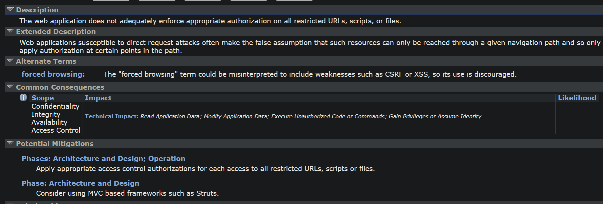
</p>
<p align="center"><em>Imagen 7: Características de la vulnerabilidad</em></p>

3. **Términos Alternativos**

   - **Navegación Forzada**: Aunque este término se utiliza en ocasiones para describir este tipo de vulnerabilidad, puede llevar a confusión al incluir debilidades como CSRF o XSS; por lo tanto, su uso no es recomendable.

4. **Relevante para "Conceptos de Investigación" (CWE-1000)**
   - **Hijo de:**  
     - [CWE-288: Bypass de Autenticación usando un Camino Alternativo](https://cwe.mitre.org/data/definitions/288.html)  
     - [CWE-424: Protección Inadecuada de un Camino Alternativo](https://cwe.mitre.org/data/definitions/424.html)  
     - [CWE-862: Falta de Autorización](https://cwe.mitre.org/data/definitions/862.html)  

   - **Puede preceder a:**  
     - [CWE-98: Control Inadecuado del Nombre de Archivo para Incluir/Require en PHP](https://cwe.mitre.org/data/definitions/98.html)  
     - [CWE-471: Modificación de Datos Asumidos como Inmutables (MAID)](https://cwe.mitre.org/data/definitions/471.html)  

5. **Relevante para "Desarrollo de Software" (CWE-699)**
- **Miembro de:**  
  - [CWE-417: Errores en Canales de Comunicación](https://cwe.mitre.org/data/definitions/417.html)  
  - [CWE-1212: Errores de Autorización](https://cwe.mitre.org/data/definitions/1212.html)  

6. **Relevante para "Debilidades en la Mapeo Simplificado de Vulnerabilidades Publicadas" (CWE-1003)**
   - **Hijo de:**  
     - [CWE-862: Falta de Autorización](https://cwe.mitre.org/data/definitions/862.html)  

7. **Relevante para "Conceptos Arquitectónicos" (CWE-1008)**
   - **Miembro de:**  
     - [CWE-1011: Autorizar Actores](https://cwe.mitre.org/data/definitions/1011.html)  


<p align="center">
  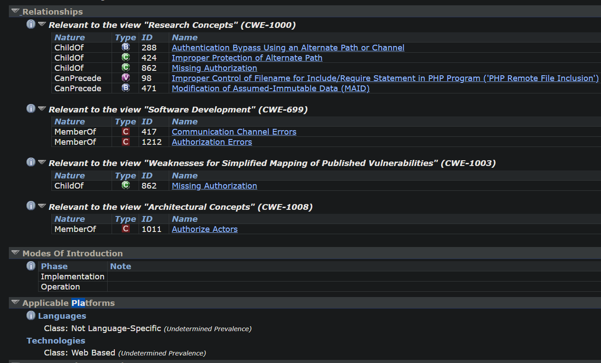
</p>
<p align="center"><em>Imagen 8: Relaciones y lenguajes de la debilidad</em></p>

> **Nota**: Es crucial no asumir que la estructura de navegación de una aplicación web impedirá el acceso directo a recursos sensibles. Cada recurso debe contar con controles de autorización propios para garantizar su protección, independientemente de cómo se acceda a él.

Más información en [cwe.mitre.org](https://cwe.mitre.org/data/definitions/425.html).

## Patrones de ataque

Encontramos numerosos patrones de ataque para esta debilidad, tales como:
- **[CAPEC-127](https://capec.mitre.org/data/definitions/127.html)** - **Directory Indexing**  
  - Este ataque ocurre cuando un servidor web permite a los atacantes listar directorios y acceder a archivos no destinados a ser públicos.
  
- **[CAPEC-143](https://capec.mitre.org/data/definitions/143.html)** - **Detect Unpublicized Web Pages**  
  - Se basa en descubrir páginas web que no están indexadas ni publicadas en enlaces visibles, pero aún son accesibles.

- **[CAPEC-144](https://capec.mitre.org/data/definitions/144.html)** - **Detect Unpublicized Web Services**  
  - Similar a CAPEC-143, pero enfocado en servicios web que no están documentados o no son intencionadamente accesibles públicamente.

- **[CAPEC-668](https://capec.mitre.org/data/definitions/668.html)** - **Key Negotiation of Bluetooth Attack (KNOB)**  
  - Este ataque compromete la negociación de claves en conexiones Bluetooth, debilitando la seguridad del cifrado.

- **[CAPEC-87](https://capec.mitre.org/data/definitions/87.html)** - **Forceful Browsing**  
  - También conocido como navegación forzada, este ataque permite a los atacantes acceder a recursos restringidos al manipular URLs directamente sin seguir la navegación prevista.

En este caso nos centraremos en el patrón de enumeración de directores:

1. **Descripción**

Este patrón de ataque se refiere a cuando un adversario envía una solicitud a un objetivo que resulta en la enumeración o listado del contenido de un directorio. Una técnica común es construir una solicitud que termine en el nombre de un directorio en lugar de un archivo, ya que muchas aplicaciones están configuradas para proporcionar una lista del contenido del directorio en tales casos. Esto permite al atacante explorar la estructura de directorios del objetivo y obtener nombres de archivos, copias de seguridad, archivos temporales, archivos ocultos, archivos de configuración, cuentas de usuario y contenido de scripts, entre otros.

2. **Relaciones**

   - **Hijo de:** [CAPEC-54: Consultar el Sistema para Obtener Información](https://capec.mitre.org/data/definitions/54.html)

3. **Flujo de Ejecución**

  - **Exploración:**
     - **Descubrimiento de Directorios:** El adversario utiliza métodos manuales, scripts o herramientas automatizadas para identificar directorios en el servidor, enviando solicitudes para nombres de directorios comunes.

  - **Experimentación:**
     - **Exploración Iterativa de Estructuras de Directorios/Archivos:** El adversario intenta acceder a los directorios descubiertos y puede intentar eludir las listas de control de acceso (ACL) del servidor o de la aplicación mediante métodos manuales o automatizados.

<p align="center">
  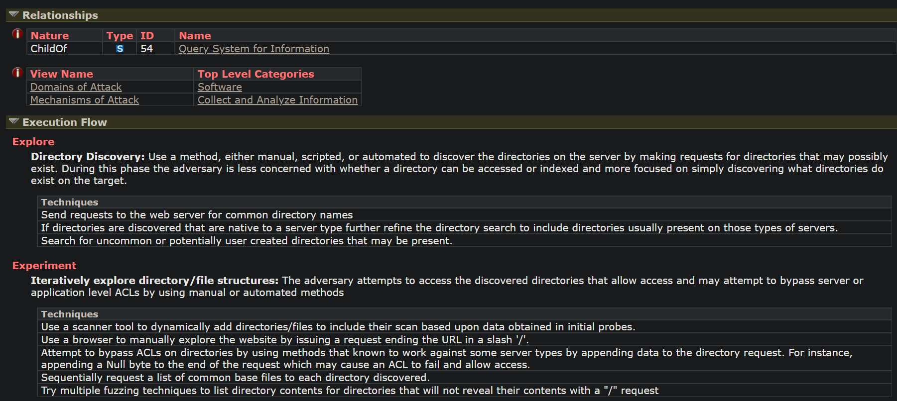
</p>
<p align="center"><em>Imagen 8: Información de relaciones y flujo de ejecución</em></p>

4. **Requisitos**

   - El servidor o la aplicación deben estar configurados para permitir la enumeración del contenido de los directorios cuando se accede a ellos directamente.

5. **Consecuencias**

   - **Confidencialidad:** Acceso no autorizado a información sensible almacenada en el servidor.
   - **Integridad:** Posible modificación no autorizada de archivos si el atacante descubre scripts o archivos de configuración vulnerables.
   - **Disponibilidad:** El atacante podría eliminar o modificar archivos críticos, afectando la disponibilidad del servicio.

> **Nota:** Para mitigar este tipo de ataques, es esencial configurar adecuadamente el servidor para evitar la enumeración de directorios y asegurar que los permisos de archivos y directorios sean restrictivos por defecto.

<p align="center">
  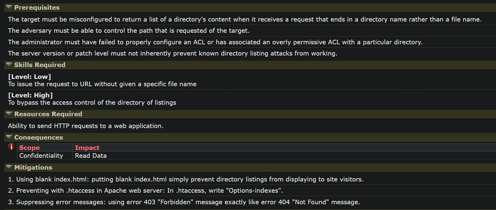
</p>
<p align="center"><em>Imagen 9: Información de requisitos, consecuencia y mitigaciones</em></p>

## JSON de información del CVE

Este JSON proporciona datos detallados sobre la vulnerabilidad **CVE-2024-0204**, los cuales pueden ser utilizados para diferentes propósitos en ciberseguridad.

Nos puede proporcionar datos clave como los siguientes:
   - **ID**: CVE-2024-0204
   - **Estado**: Publicado
   - **Asignado por**: Fortra
   - **Fecha de Publicación**: 22 de enero de 2024
   - **Última Actualización**: 13 de febrero de 2025
   - **Producto Afectado**
   - **Descripción y Explotabilidad**
   - **Métricas CVSS (Severidad)**
   - **Soluciones y Mitigaciones**
   - **Fuentes y Referencias**

<p align="center">
  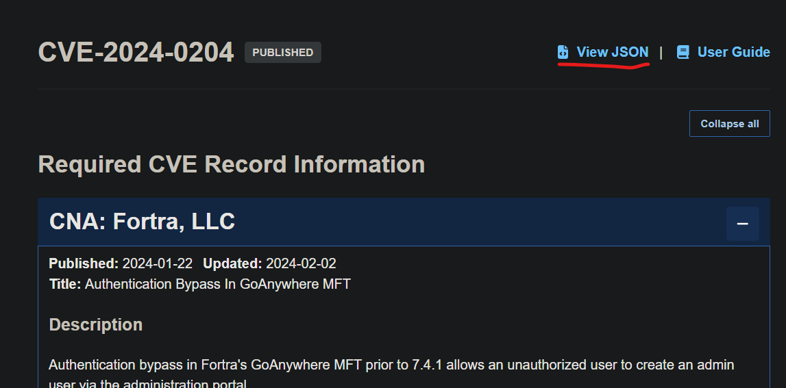
</p>
<p align="center"><em>Imagen 10: Como obtener el json</em></p>

Estos JSON pueden ayudar para:
- **Seguimiento y rastreo** de vulnerabilidades en bases de datos de CVEs.  
- **Identificación de software afectado** en sistemas de gestión de vulnerabilidades (VMS) y soluciones SIEM.  
- **Evaluación de riesgos y creación de reglas** en sistemas IDS/IPS.  
- **Determinación de la prioridad de remediación** en herramientas de gestión de riesgos y plataformas de seguridad.  
- **Provisión de instrucciones clave** para equipos de TI y seguridad para mitigar el riesgo en infraestructura afectada.  
- **Integración con plataformas de threat intelligence** y bases de datos de vulnerabilidades.  
- **Desarrollo de firmas para antivirus y soluciones EDR/XDR**.  
- **Soporte en auditoría y pruebas de penetración (Pentesting)** para evaluar la seguridad de sistemas y aplicaciones.  

El json es el siguiente:
```json
{"dataType":"CVE_RECORD","dataVersion":"5.1","cveMetadata":{"cveId":"CVE-2024-0204","assignerOrgId":"df4dee71-de3a-4139-9588-11b62fe6c0ff","state":"PUBLISHED","assignerShortName":"Fortra","dateReserved":"2024-01-03T00:12:28.436Z","datePublished":"2024-01-22T18:05:13.194Z","dateUpdated":"2025-02-13T17:27:06.436Z"},"containers":{"cna":{"affected":[{"defaultStatus":"affected","product":"GoAnywhere MFT","vendor":"Fortra","versions":[{"lessThan":"7.4.1","status":"affected","version":"6.0.1","versionType":"semver"}]}],"credits":[{"lang":"en","type":"finder","user":"00000000-0000-4000-9000-000000000000","value":"Mohammed Eldeeb & Islam Elrfai, Spark Engineering Consultants"}],"descriptions":[{"lang":"en","supportingMedia":[{"base64":false,"type":"text/html","value":"Authentication bypass in Fortra's GoAnywhere MFT prior to 7.4.1 allows an unauthorized user to create an admin user via the administration portal."}],"value":"Authentication bypass in Fortra's GoAnywhere MFT prior to 7.4.1 allows an unauthorized user to create an admin user via the administration portal."}],"impacts":[{"capecId":"CAPEC-1","descriptions":[{"lang":"en","value":"CAPEC-1 Accessing Functionality Not Properly Constrained by ACLs"}]}],"metrics":[{"cvssV3_1":{"attackComplexity":"LOW","attackVector":"NETWORK","availabilityImpact":"HIGH","baseScore":9.8,"baseSeverity":"CRITICAL","confidentialityImpact":"HIGH","integrityImpact":"HIGH","privilegesRequired":"NONE","scope":"UNCHANGED","userInteraction":"NONE","vectorString":"CVSS:3.1/AV:N/AC:L/PR:N/UI:N/S:U/C:H/I:H/A:H","version":"3.1"},"format":"CVSS","scenarios":[{"lang":"en","value":"GENERAL"}]}],"problemTypes":[{"descriptions":[{"cweId":"CWE-425","description":"CWE-425 Direct Request ('Forced Browsing')","lang":"en","type":"CWE"}]}],"providerMetadata":{"orgId":"df4dee71-de3a-4139-9588-11b62fe6c0ff","shortName":"Fortra","dateUpdated":"2024-02-02T17:06:23.244Z"},"references":[{"tags":["vendor-advisory"],"url":"https://www.fortra.com/security/advisory/fi-2024-001"},{"tags":["permissions-required"],"url":"https://my.goanywhere.com/webclient/ViewSecurityAdvisories.xhtml"},{"url":"http://packetstormsecurity.com/files/176683/GoAnywhere-MFT-Authentication-Bypass.html"},{"url":"http://packetstormsecurity.com/files/176974/Fortra-GoAnywhere-MFT-Unauthenticated-Remote-Code-Execution.html"}],"solutions":[{"lang":"en","supportingMedia":[{"base64":false,"type":"text/html","value":"Upgrade to version 7.4.1 or higher. The vulnerability may also be eliminated in non-container deployments by deleting the&nbsp;InitialAccountSetup.xhtml file in the install directory and restarting the services. For container-deployed instances, replace the file with an empty file and restart. For additional information, see&nbsp;<a target=\"_blank\" rel=\"nofollow\" href=\"https://my.goanywhere.com/webclient/ViewSecurityAdvisories.xhtml\">https://my.goanywhere.com/webclient/ViewSecurityAdvisories.xhtml</a>&nbsp;(registration required).<a target=\"_blank\" rel=\"nofollow\" href=\"https://my.goanywhere.com/webclient/ViewSecurityAdvisories.xhtml\"></a>"}],"value":"Upgrade to version 7.4.1 or higher. The vulnerability may also be eliminated in non-container deployments by deleting the InitialAccountSetup.xhtml file in the install directory and restarting the services. For container-deployed instances, replace the file with an empty file and restart. For additional information, see  https://my.goanywhere.com/webclient/ViewSecurityAdvisories.xhtml https://my.goanywhere.com/webclient/ViewSecurityAdvisories.xhtml  (registration required).  https://my.goanywhere.com/webclient/ViewSecurityAdvisories.xhtml"}],"source":{"advisory":"XXX-YYY","discovery":"UNKNOWN"},"title":"Authentication Bypass in GoAnywhere MFT","workarounds":[{"lang":"en","supportingMedia":[{"base64":false,"type":"text/html","value":"Users are encouraged to apply defense-in-depth tactics to limit access to the administrative console. Do not expose the console to the internet and apply web application controls such as a WAF, monitoring, and access controls.&nbsp;"}],"value":"Users are encouraged to apply defense-in-depth tactics to limit access to the administrative console. Do not expose the console to the internet and apply web application controls such as a WAF, monitoring, and access controls."}],"x_generator":{"engine":"Vulnogram 0.1.0-dev"}},"adp":[{"providerMetadata":{"orgId":"af854a3a-2127-422b-91ae-364da2661108","shortName":"CVE","dateUpdated":"2024-08-01T17:41:15.984Z"},"title":"CVE Program Container","references":[{"tags":["vendor-advisory","x_transferred"],"url":"https://www.fortra.com/security/advisory/fi-2024-001"},{"tags":["permissions-required","x_transferred"],"url":"https://my.goanywhere.com/webclient/ViewSecurityAdvisories.xhtml"},{"url":"http://packetstormsecurity.com/files/176683/GoAnywhere-MFT-Authentication-Bypass.html","tags":["x_transferred"]},{"url":"http://packetstormsecurity.com/files/176974/Fortra-GoAnywhere-MFT-Unauthenticated-Remote-Code-Execution.html","tags":["x_transferred"]}]}]}}

```